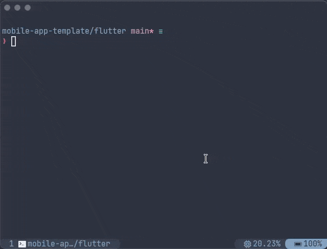

# homebrew-tools

A Homebrew tap for Valian's internal developer tools.

## Available tools

| Tool  | Description                                    | Install                             |
| ----- | ---------------------------------------------- | ----------------------------------- |
| [`frn`](#frn) | Fast `flutter run` launcher with device picker | `brew install valian-ca/tools/frn` |

## Install the tap

```sh
brew tap valian-ca/tools
```

The `homebrew-` prefix is dropped from the tap name by Homebrew convention.

## Upgrading

```sh
brew update
brew upgrade valian-ca/tools/<name>
```

---

## `frn`

Fast `flutter run` launcher with device picker. Implemented in Go; `brew
install` compiles it from source (pulls `go` as a build dependency).



### Why frn?

- **Fast.** Device picker pops in ~200 ms vs `flutter run`'s ~7 s before it even shows devices.
- **Remembers your choice.** Last used flavor + device are persisted per-project in
  `.dart_tool/valian/frn.json` — re-runs are one `<enter>`.
- **Flavors done right.** Auto-detects Android `productFlavors`, iOS schemes, and
  `lib/main_*.dart` entry points. No more forgetting `--flavor development`.
- **VM service URI auto-wired.** Writes to `.dart_tool/valian/vmservice.uri` so other Valian
  tooling can auto-attach — no manual `--vmservice-out-file` flag.

---

## Contributing

See [CLAUDE.md](./CLAUDE.md) for conventions when adding a new tool or
modifying an existing one — naming rules, dependency policy, bash
compatibility notes, and the release process.

### Release process (short form)

1. Commit changes to `bin/<tool>` (and any formula updates) on `main`.
2. Tag a release using a per-tool prefix:
   ```sh
   git tag <tool>-0.1.1
   git push --tags
   ```
3. Compute the tarball's sha256:
   ```sh
   curl -sL https://github.com/valian-ca/homebrew-tools/archive/refs/tags/<tool>-0.1.1.tar.gz \
     | shasum -a 256
   ```
4. Update the formula's `url` and `sha256` in a follow-up commit.
5. Teammates run `brew upgrade valian-ca/tools/<tool>`.

## CI

Every PR and push to `main` runs:

- `go vet ./...`, `go test ./...`, `golangci-lint run` — for Go packages.
- `shellcheck -x bin/*` — when `bin/` contains scripts.
- `brew audit --strict --online valian-ca/tools/<name>` — only when a formula changes.
